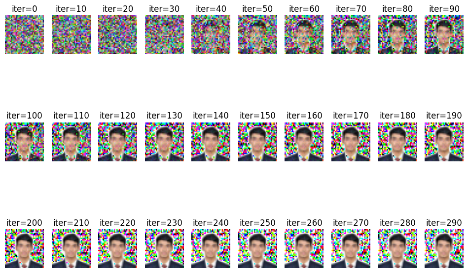

# OptML Project: On the Effect of Quantization on Deep Leakage from Gradients and Train-Test Accuracy



**Authors:** Arvind Satish Menon, Lars C.P.M. Quaedvlieg, and Sachin Bhadang

## Important Links
- In-depth project description: https://github.com/epfml/OptML_course/blob/master/labs/mini-project/miniproject_description.pdf

## Objective

This project aims to explore advanced quantization techniques to improve privacy preservation in distributed machine 
learning systems without significantly degrading model performance.

## Project introduction

Distributed machine learning systems have adopted the practice of sharing gradients rather than raw data to enhance
privacy. However, these shared gradients can still be susceptible to privacy breaches through inversion attacks.
Previous studies like Deep Leakage from Gradients (DLG) have shown that while mechanisms such as noise addition and
gradient compression can mitigate these attacks, they often result in a substantial decrease in model accuracy. This
project builds upon these findings by investigating quantization methods as a potential solution to balance both
privacy preservation and model performance effectively.

**Please note that not all the code is the work of this project group**. We will use a basis provided by the DLG paper.
For an idea of this basis, please utilize [this repository](https://github.com/mit-han-lab/dlg). However, we also
merged these methods with our project contributions.

## Getting Started

Clone the project to your local machine.

### Requirements

Make sure to install an environment with Python 3.10.12 to match the version we used in our paper.

Locate the repository and run:
```sh
pip install -r requirements.txt
```

**Additionally**, you need to install PyTorch separately. please note that for installing
[PyTorch](https://pytorch.org/get-started/locally/), please refer to the references installation guides for CPU or 
GPU and ensure that a *compatible version* of PyTorch has been installed. For example, with CUDA 12.1, you can run `pip3 install torch torchvision --index-url https://download.pytorch.org/whl/cu121`.

| Package             | Use                         |
|---------------------|-----------------------------|
| Pytorch (Geometric) | Automatic Differentiation   |
| Networkx            | Graph representation        |
| Casadi              | Nonlinear optimization      |
| Numpy               | Numerical computations      |
| Matplotlib          | Plotting and visualizations |
| PyQt5               | Plotting and visualizations |
| Tensorboard         | Experiment visualizations   |

### Usage

The RL model can be trained using a certain configuration (see format below) via the "main.py" file. This is also where
simulations are configured, including e.g., designing traffic scenarios and setting up the optimal controllers.

Next, the "inference.py" file allows you to perform inference using certain configurations of the environment and a
trained agent model.


## Structure of the repository

    .
    ├── out               # Any output files generated from the code
    ├── res               # Any resources that can be or are used in the code (e.g. configurations)
    ├── src               # Source code of the project
    ├── .gitignore        # GitHub configuration settings
    ├── README.md         # Description of the repository
    └── requirements.txt  # Python packages to install before running the code

### Out
    .
    ├── out                   
    │   └── runs          # Contains folders for experiment logs and models etc.
    │       └── example   # Example experiment folder containing a trained model
    └── ...

> This is the directory in which all the output files generated from the code are stored

### Res
    .
    ├── ...
    ├── res                   
    │   ├── model_hyperparams             # Directory storing a configuration for the RL model hyperparameters
    │   │   └── example_hyperparams.json  # Example configuration file for the hyperparameters
    │   ├── ex2.csv                       # Example file with raw data generated in the simulation (only used for intuition)
    │   ├── metaData_ex2.txt              # Metadata for ex2.csv
    │   └── simRes.gif                    # Example GIF of one episode in the simulation
    └── ...

> This is the directory where any resources that can be or are used in the code (e.g. configurations)

### Src
    .
    ├── ...
    ├── src  
    │   ├── agents                 # The package created for storing anything related to the RL agent
    │   │   ├── __init__.py        # Creates the Python package
    │   │   ├── graphs.py          # File containing class for creating the graph datastructures
    │   │   └── rlagent.py         # File containing anything from the network architecture to the Deep Q-learning agent
    │   ├── controllers.py         # Generates optimal controller based on specified scenario, and optimizes the trajectory choice, returns optimal policy
    │   ├── helpers.py             # Contains assisting functions, e.g., for data extraction and plotting
    │   ├── inference.py           # Performing inference with a trained RL agent
    │   ├── main.py                # Setting up and running simulations to train the RL agent
    │   ├── scenarios.py           # Formulates constraints for the different scenarios considered in the optimal controllers
    │   ├── traffic.py             # Combined traffic: Used to communicate with all vehicles in traffic scenario, creates a vehicle with specified starting position, velocity and class.
    │   └── vehicleModelGarage.py  # Contains truck models that can be utilized in the simulation
    └── ...

> This is the directory that contains all the source code for this project

### Arguments for executable files

#### main.py

To run this script, at a minimum you must provide a hyperparameter configuration file in json format, specified with the -H flag. We have provided an example file containing the hyperparameters we used for our final model, meaning the script can be run directly from inside the src folder with the following command:

```bash
$ python main.py -H ../res/model_hyperparams/example_hyperparams.json
```

_Note: this assumes that the out/runs folder exists in the repo (which it should after cloning). If not, you can specify an alternate log directory with the -l flag, where all outputs will be saved._

It is also recommended, but not necessary, to provide an experiment ID with the -E flag, to make it easier to locate the results of your experiment in the log directory. The result are saved in the log directory in a folder named as {experiment_ID}_{timestamp}.

The full list of input arguments for this script is shown below, and the remaining arguments have defaults but can be used to change various simulation parameters.

```bash
$ python main.py -h

usage: main.py [-h] -H HYPERPARAM_CONFIG [-l LOG_DIR] [-e NUM_EPISODES]
               [-d MAX_DIST] [-t TIME_STEP] [-f CONTROLLER_FREQUENCY]
               [-s SPEED_LIMIT] [-N HORIZON_LENGTH] [-T SIMULATION_TIME]
               [-E EXP_ID] [--display_simulation]

Train DeepQN RL agent for lane changing decisions

options:
  -h, --help            show this help message and exit
  -H HYPERPARAM_CONFIG, --hyperparam_config HYPERPARAM_CONFIG
                        Path to json file containing the hyperparameters for
                        training the GNN. Must define the following
                        hyperparameters: gamma (float), target_copy_delay
                        (int), learning_rate (float), batch_size (int),
                        epsilon (float), epsilon_dec (float), epsilon_min
                        (float), memory_size (int)
  -l LOG_DIR, --log_dir LOG_DIR
                        Directory in which to store logs. Default ../out/runs
  -e NUM_EPISODES, --num_episodes NUM_EPISODES
                        Number of episodes to run simulation for. Default 100
  -d MAX_DIST, --max_dist MAX_DIST
                        Goal distance for vehicle to travel. Simulation
                        terminates if this is reached. Default 10000m
  -t TIME_STEP, --time_step TIME_STEP
                        Simulation time step. Default 0.2s
  -f CONTROLLER_FREQUENCY, --controller_frequency CONTROLLER_FREQUENCY
                        Controller update frequency. Updates at each f
                        timesteps. Default 5
  -s SPEED_LIMIT, --speed_limit SPEED_LIMIT
                        Highway speed limit (km/h). Default 60
  -N HORIZON_LENGTH, --horizon_length HORIZON_LENGTH
                        MPC horizon length. Default 12
  -T SIMULATION_TIME, --simulation_time SIMULATION_TIME
                        Maximum total simulation time (s). Default 100
  -E EXP_ID, --exp_id EXP_ID
                        Optional ID for the experiment
  --display_simulation  If provided, the simulation will be plotted and shown
                        at each time step
```

_This script has a hard-coded seed, thus to reproduce any experiments you simply need to provide the same hyperparameter configurations and input arguments to the script. For each experiment, we save all the experiment parameters (including hyperparameter configurations) inside the experiment log folder, in a file called experiment_parameters.json_

#### inference.py

At a minimum, this script requires you to specify the log directory where all results are saved, and the ID of the experiment which was used to train the model you want to perform inference with. As mentioned before, directly cloning the repo should include an out/runs folder, which is the default log directory in both main.py and inference.py. If you used a different log directory, you can specify it with the -l argument. Otherwise, the only argument you have to provide is the experiment ID using the -E flag. Note that this should be the entire folder name (including the timestamp if it's there), and the folder must contain a file named final_model.pt (which is automatically output by main.py). As an example, the the script can be run directly from inside the src folder as follows, using the example experiment directory provided:


```bash
$ python inference.py -E example -e 30 -T 30
```

This command will run the simulation for 30 episodes of 30s each.

The full list of input arguments is shown below. The remaining arguments have defaults but can be used to change various simulation parameters.

```bash
$ python inference.py -h

usage: inference.py [-h] [-E EXP_ID] [-l LOG_DIR] [-e NUM_EPISODES]
                    [-d MAX_DIST] [-t TIME_STEP] [-f CONTROLLER_FREQUENCY]
                    [-s SPEED_LIMIT] [-N HORIZON_LENGTH] [-T SIMULATION_TIME]
                    [--display_simulation]

Simulate truck driving scenarios using trained DQN agent for lane change
decisions

options:
  -h, --help            show this help message and exit
  -E EXP_ID, --exp_id EXP_ID
                        ID of the experiment who's model we want to use
  -l LOG_DIR, --log_dir LOG_DIR
                        Directory in which logs are stored. Default
                        ../out/runs
  -e NUM_EPISODES, --num_episodes NUM_EPISODES
                        Number of episodes to run simulation for. Default 100
  -d MAX_DIST, --max_dist MAX_DIST
                        Goal distance for vehicle to travel. Simulation
                        terminates if this is reached. Default 10000m
  -t TIME_STEP, --time_step TIME_STEP
                        Simulation time step. Default 0.2s
  -f CONTROLLER_FREQUENCY, --controller_frequency CONTROLLER_FREQUENCY
                        Controller update frequency. Updates at each f
                        timesteps. Default 5
  -s SPEED_LIMIT, --speed_limit SPEED_LIMIT
                        Highway speed limit (km/h). Default 60
  -N HORIZON_LENGTH, --horizon_length HORIZON_LENGTH
                        MPC horizon length. Default 12
  -T SIMULATION_TIME, --simulation_time SIMULATION_TIME
                        Maximum total simulation time (s). Default 100
  --display_simulation  If provided, the simulation will be plotted and shown
                        at each time step
```